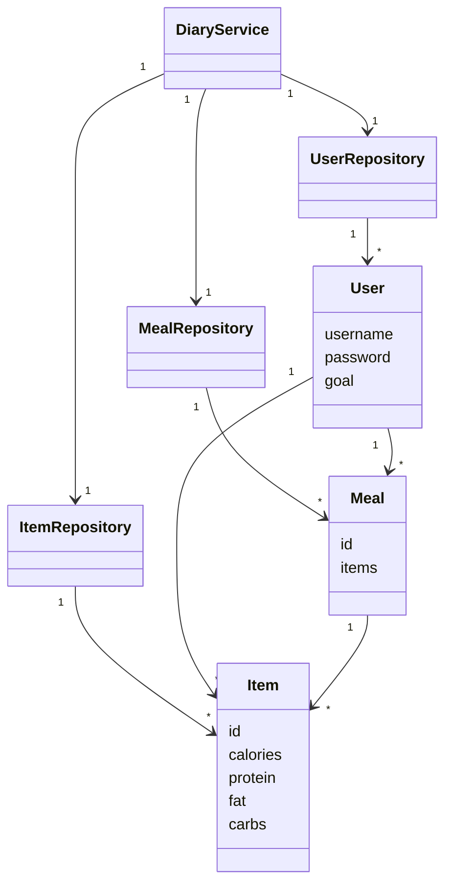

# Sovelluksen arkkitehtuuri

## Luokkakaavio

```mermaid
 classDiagram
      DiaryService "1" --> "1" UserRepository
      DiaryService "1" --> "1" MealRepository
      DiaryService "1" --> "1" ItemRepository
      UserRepository "1" --> "*" User
      MealRepository "1" --> "*" Meal
      ItemRepository "1" --> "*" Item
      User "1" --> "*" Meal
      User "1" --> "*" Item
      Meal "1" --> "*" Item
      class User{
          username
          password
          goal
      }
      class Meal{
          id
          items
      }
      class Item{
        id
        calories
        protein
        fat
        carbs
      }
```
