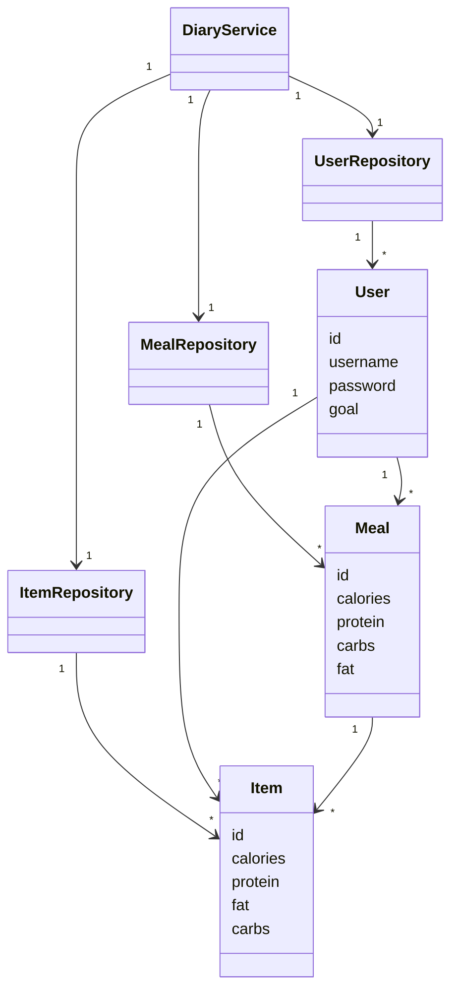
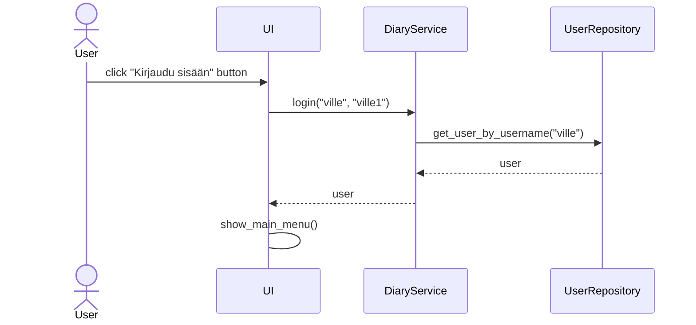
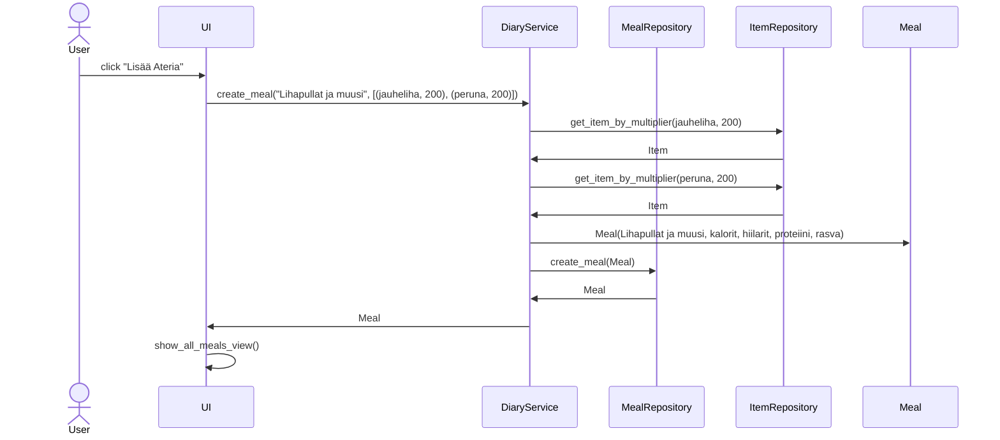

# Sovelluksen arkkitehtuuri

## Rakenne

Ohjelma koostuu kolmesta eriytetystä kerroksesta, jotka kommunikoivat keskenään.

Käyttöliittymä UI kutsuu sovelluslogiikasta vastaavaa services pakkausta, joka puolestaan kutsuu tietokantaoperaatioista vastaavaa repositories pakkausta. Services ja repositories kutsuvat entities pakkausta joka sisältää yksittäiset luokat, jotka kuvastavat ohjelmaan lisättyjä tietokohteita.

## Käyttöliittymä

Käyttöliittymä koostuu aloitusnäkymästä, josta pääsee joko kirjautumaan tai luomaan uuden käyttäjän.

Kirjautumisen jälkeen ohjelma ohjautuu päävalikkoon, josta voidaan navigoida nykyiseen päivään, käyttäjän omiin tietoihin, lisättyihin aterioihin, lisäämään ruoka-aineen tai kirjautumaan ulos.

Nykyisen päivän näkymässä käyttäjä voi lisätä kyseiselle päivälle aterioita, joista näkyy kooste sivuston alareunassa.

Omat tiedot mahdollistaa käyttäjän tavoitteen asettamisen sekä käyttäjänimen vaihdon

Lisätyt ateriat näyttää käyttäjän ja muiden käyttäjien sovellukseen lisäämät ateriat. Lisäksi sivu sisältää mahdollisuuden siirtyä luomaan uuden aterian.

Näkymät on toteutettu omina luokkinaan ja niiden esittämisen hoitaa UI-luokka. Käyttöliittymä kutsuu DiaryService luokkaa sovelluslogiikan toimintoja varten. Käyttöliittymään on myös toteutettu kaksi komponenttia joita käytetään näkymien toimesta kutsumalla ulkoista luokkaa, mikä mahdollistaa niiden käyttämisen useammassa näkymässä.

## Sovelluslogiikka

Sovelluksessa DiaryService kutsuu repositorioita, jotka suorittavat tietokantaoperaatiot. Sovelluksen tietokohteet koostuvat luokista Item, Meal, User.

## Tietojen pysyväistallennus

Sovelluksen tiedot tallennetaan tietokantaan, joka koostuu 4 eri taulusta:
Users
Meals
Items
Today_meals
Tietokanta alustetaan initialize_database.py tiedostossa, jonka suoritus onnistuu poetry run invoke build komennolla.

## Toiminnallisuus

Käyttäjän kirjautuessa sovellus toimii seuraavasti:

Käyttäjän painaessa kirjautumisnappia sovelluksen käyttöliittymä kutsuu sovelluslogiikan DiaryService luokan metodia login, joka puolestaan kutsuu UserRepositoryn get_user_by_username metodia. Metodi hakee tietokannasta käyttäjää, joka vastaa käyttäjänimeen. Jos käyttäjä löytyy ja annettu salasana vastaa tietokannassa olevan käyttäjän salasanaan, palauttaa metodi User olion, joka sisältää käyttäjän tiedot. Käyttöliittymä siirtää sitten käyttäjän päävalikkoon.

Käyttäjä koostaa lisätyistä ruoka-aineista aterian:

Käyttöliittymä kutsuu DiaryService luokan create_meal metodia parametreinä aterian nimi sekä lista tupleja, jotka koostuvat ruoka-aineen item oliosta ja aterian sisältämästä määrästä. DiaryService kutsuu ItemRepositorya jokaisen ruoka-aineen kohdalla ja palautuksena tulee Item olio, jolla on ruoka-aineen makrot skaalattuna haluttuun määrään. Sitten DiaryService luo Meal olion parametreinään aterian nimi sekä makroravinteet. Diaryservice kutsuu MealRepositoryn create_meal metodia parametrinä Meal olio. Lopulta UI palauttaa näkymän kaikkien lisättyjen aterioiden listaukseen.

## Rakenteen heikkoudet

Meal ja Item oliot koostuvat samanlaisista parametreistä. Meal olion voisi koostaa tulevaisuudessa viittauksista Items tauluun tallennettuihin olioihin. Käyttöliittymässä voisi olla enemmän luotu komponentteja omien metodien kautta eikä _initialize metodissa.
