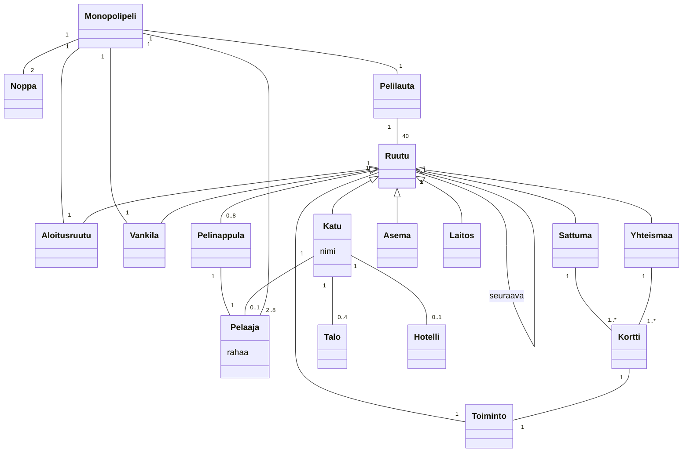

## Monopoli, alustava luokkakaavio

```mermaid
 classDiagram
    Monopolipeli "1" -- "2" Noppa
    Monopolipeli "1" -- "1" Pelilauta
    Monopolipeli "1" -- "1" Aloitusruutu
    Monopolipeli "1" -- "1" Vankila
    Pelaaja "2..8" -- "1" Monopolipeli
    Pelilauta "1" -- "40" Ruutu
    Pelinappula "1" -- "1" Pelaaja
    Ruutu "1" -- "1" Ruutu : seuraava

    Ruutu <|-- Aloitusruutu
    Ruutu <|-- Vankila
    Ruutu <|-- Sattuma
    Ruutu <|-- Yhteismaa
    Ruutu <|-- Katu
    Ruutu <|-- Asema
    Ruutu <|-- Laitos
    Ruutu "1" -- "0..8" Pelinappula
    Ruutu "1" -- "1" Toiminto

    Sattuma "1" -- "1..*" Kortti
    Yhteismaa "1" -- "1..*" Kortti
    Kortti "1" -- "1" Toiminto

    Katu "1" -- "0..4" Talo
    Katu "1" -- "0..1" Hotelli
    Katu "1" -- "0..1" Pelaaja

    class Pelaaja{
        rahaa
    }
    class Katu{
        nimi
    }
```
